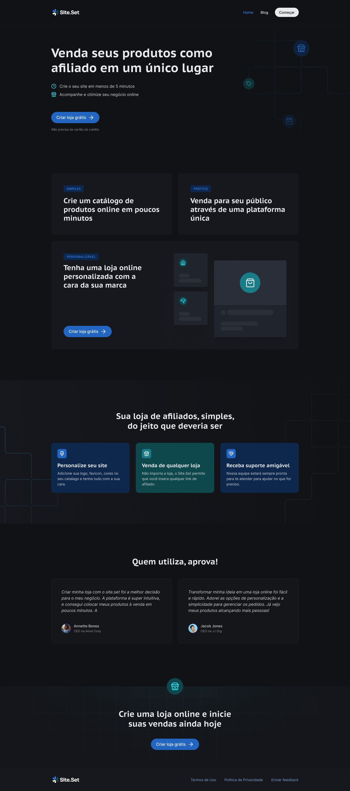

<h1 align="center">
  
</h1>

<p align="center">
  

  

  
  
  <a href="https://github.com/pabloxt14/site-set/commits/master">
    
  </a>
    
   

   <a href="https://github.com/pabloxt14/site-set/stargazers">
    
  </a>
</p>

<p>
  
</p>

<p align="center">
 <a href="#-about">About</a> | 
 <a href="#-deploy">Deploy</a> |
 <a href="#-layout">Layout</a> | 
 <a href="#-setup">Setup</a> | 
 <a href="#-technologies">Technologies</a> | 
 <a href="#-license">License</a>
</p>


## 💻 About

Esta aplicação de nome **Site.Set** consiste basicamente em um site responsivo de apresentação de uma plataforma para venda de produtos online.

Os principais conhecimentos aplicados nesta aplicação foram:
- Criação de sites completos com `Next.js`, tendo recursos como `SSR`, `SSG` e `ISR`
- Compreensão das estruturas de `Pages Router` (antiga) e `App Router` (nova) do Next.js
- Uso da lib `Contentlayer` para geração de conteúdos dinâmicos de cada post
- Estilização utilizando `TailwindCSS` e componentes pré-estilizados com `Shadcn UI`


## 🔗 Deploy

O deploy da aplicação pode ser acessada através da seguinte URL base: https://site-set-chi.vercel.app/


## 🎨 Layout

Você pode visualizar o layout do projeto através [desse link](https://www.figma.com/community/file/1491107537598172161/landing-page-e-blog). É necessário ter conta no [Figma](https://www.figma.com/) para acessá-lo.

A seguir, veja uma demonstração das principais telas da aplicação:

### Landing Page

<p align="center">
  
</p>

### Blog Page

<p align="center">
  
</p>

### Post Page

<p align="center">
  
</p>


## ⚙ Setup

### 📝 Requisites

Antes de baixar o projeto você vai precisar ter instalado na sua máquina as seguintes ferramentas:

* [Git](https://git-scm.com)
* [NodeJS](https://nodejs.org/en/)
* [NPM](https://www.npmjs.com/), [Yarn](https://yarnpkg.com/) ou [PNPM](https://pnpm.io/)

Além disto é bom ter um editor para trabalhar com o código como [VSCode](https://code.visualstudio.com/)

### Cloning and Running

Passo a passo para clonar e executar a aplicação na sua máquina:

```bash
# Clone este repositório
$ git clone git@github.com:pabloxt14/site-set.git

# Instale as dependências
$ npm install

# Gerar as configurações do Contentlayer
$ npx contentlayer build

# Inicie o projeto
$ npm run dev
```


## 🛠 Technologies

As seguintes principais ferramentas foram usadas na construção do projeto:

- **[Next.js](https://nextjs.org/)**
- **[React](https://react.dev/)**
- **[TypeScript](https://www.typescriptlang.org/)**
- **[TailwindCSS](https://tailwindcss.com/)**
- **[Shadcn UI](https://ui.shadcn.com/)**
- **[Contentlayer](https://contentlayer.dev/)**
- **[Lucide Icons](https://lucide.dev/)**
- **[React Markdown](https://github.com/remarkjs/react-markdown)**

> Para mais detalhes das dependências gerais da aplicação veja o arquivo [package.json](./package.json)


## 📝 License

Este projeto está sob a licença MIT. Consulte o arquivo [LICENSE](./LICENSE) para mais informações

<p align="center">
  Feito com 💜 por Pablo Alan 👋🏽 <a href="https://www.linkedin.com/in/pabloalan/" target="_blank">Entre em contato!</a>  
</p>